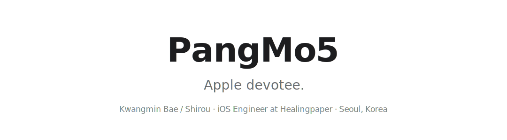
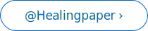
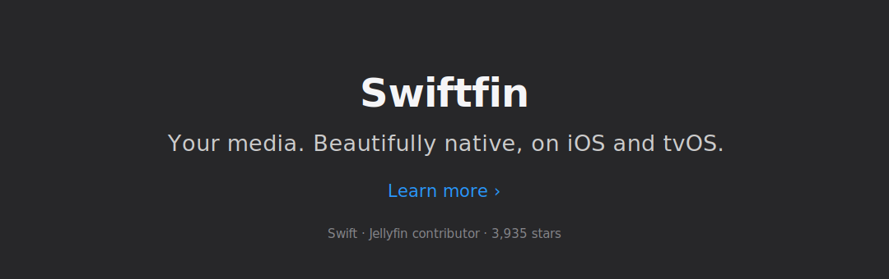
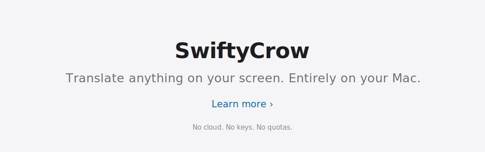
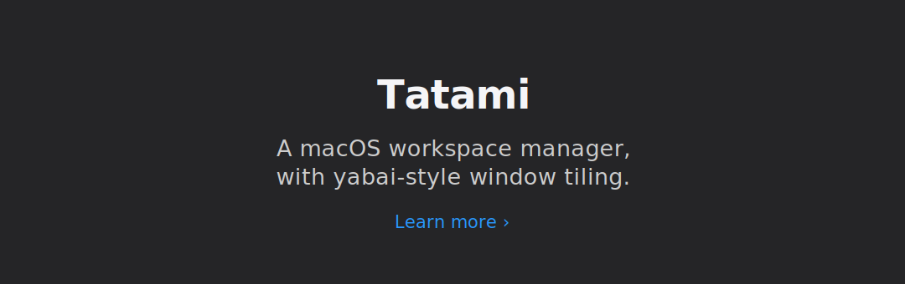
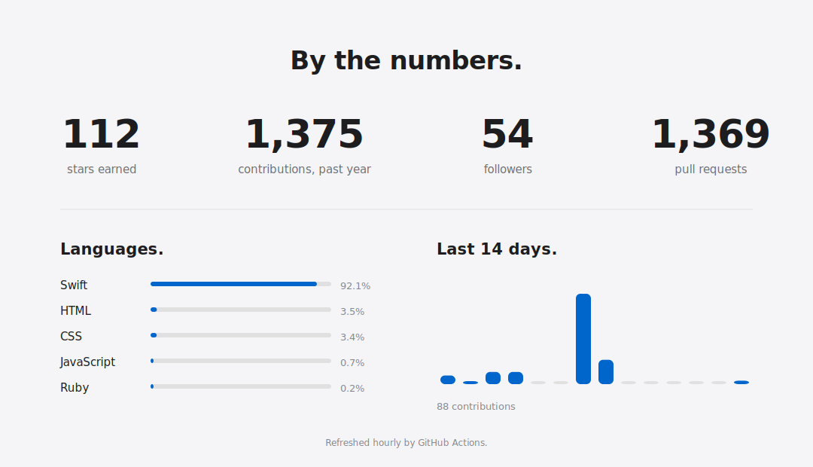

<picture>
  <source media="(prefers-color-scheme: dark)" srcset="assets/hero-dark.svg">
  
</picture>

&nbsp;&nbsp;<a href="https://github.com/Healingpaper"><picture><source media="(prefers-color-scheme: dark)" srcset="assets/btn-work-dark.svg"></picture></a>

  

<a href="https://github.com/PangMo5/SwiftyCrow"><picture><source media="(prefers-color-scheme: dark)" srcset="assets/tile-swiftycrow-dark.svg"></picture></a>

  

<picture><source media="(prefers-color-scheme: dark)" srcset="assets/metrics-dark.svg"></picture>

Designed in Seoul. Written in Swift. © 2026 Kwangmin Bae.

